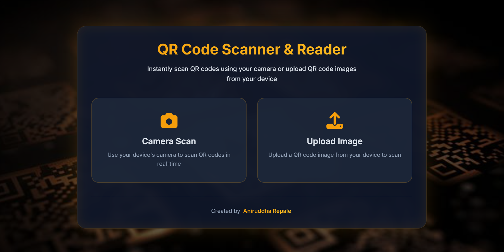
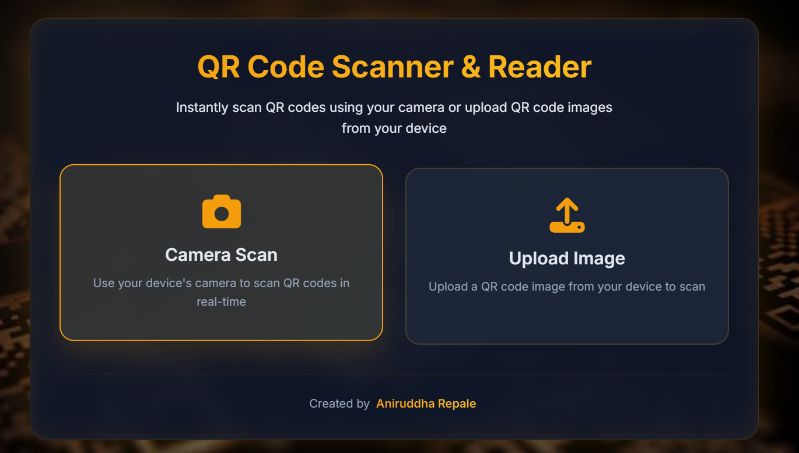
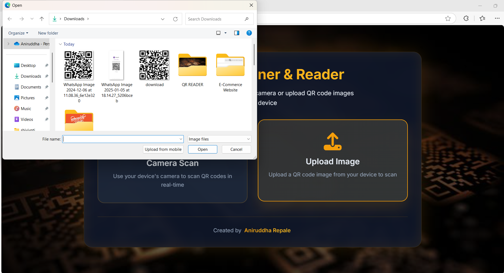
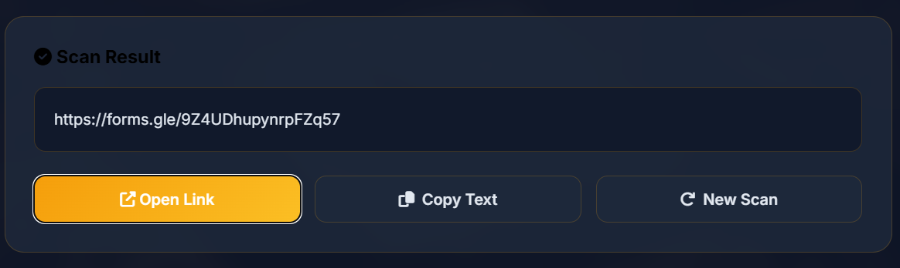

# QR Code Reader 📸

A **feature-rich QR Code Scanner and Reader** built using **HTML5**, **CSS3**, and **JavaScript**, enabling users to scan QR codes effortlessly via camera or image upload.  

## ✨ Features:
- **Camera Scanning**: Instantly scan QR codes using your device’s camera in real time.
- **Image Upload Scanning**: Upload an image with a QR code for quick decoding.
- **Dynamic Results**:
  - Auto-detects URLs and allows one-click navigation.
  - Copy decoded text with a single click.
- **Error Handling**: Displays user-friendly messages for invalid QR codes or camera issues.
- **Interactive UI**: Smooth animations, elegant icons, and a dark-themed, responsive design.

## 📂 Project Files:
- **`index.html`**: The structural foundation of the project.
- **`style.css`**: A dark-mode aesthetic with golden accents, ensuring a polished look.
- **`script.js`**: Implements QR scanning logic and real-time interactivity using the `html5-qrcode` library.

## 🚀 How It Works:
1. **Camera Scan**: Tap the "Camera Scan" option, grant camera access, and scan QR codes in real time.
2. **Upload Image**: Choose the "Upload Image" option to decode QR codes from your files.
3. **View Results**: Copy text or open links from the decoded QR data instantly.

## 🌟 Getting Started:
1. Clone the repository.
2. Open `index.html` in a browser.
3. Start scanning QR codes and enjoy the smooth experience!

